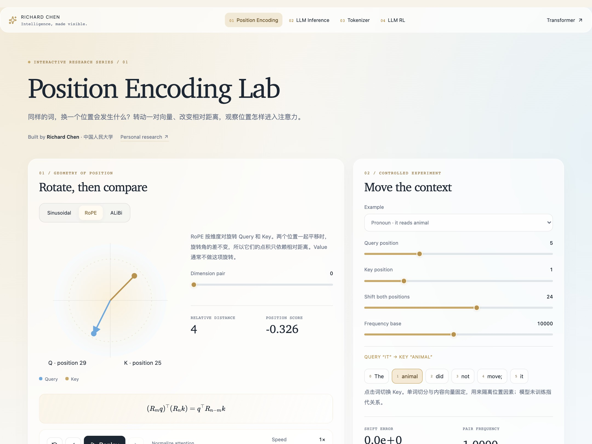
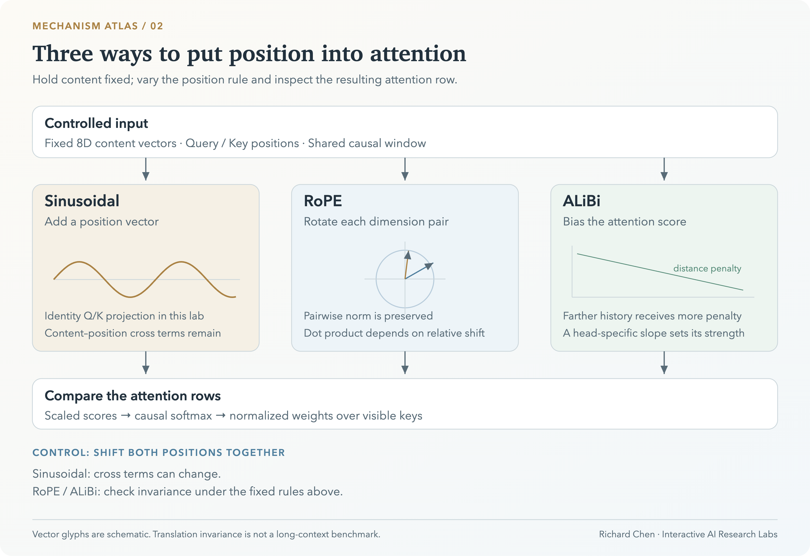
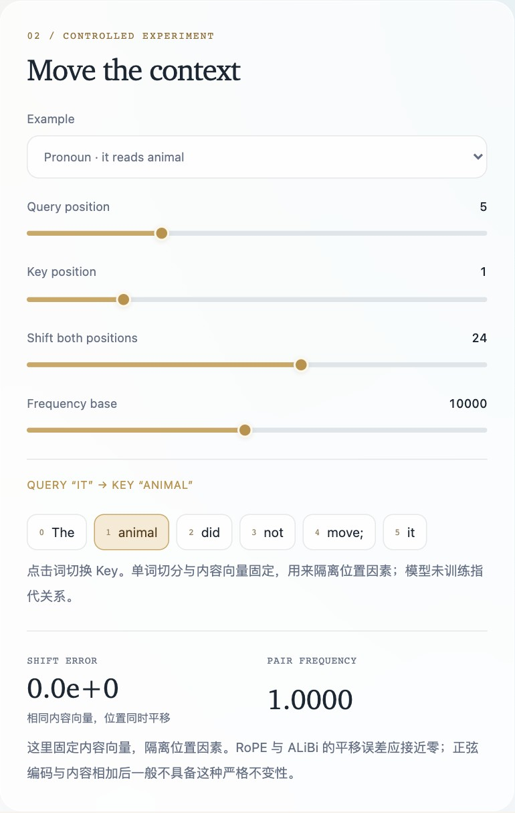
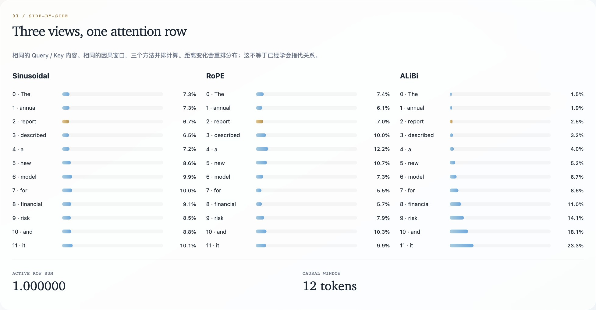

# Position Encoding Lab

**看见位置如何成为几何。**

在相同内容向量与因果窗口中，对比 **Sinusoidal、RoPE 和 ALiBi**。旋转向量、平移上下文、调节距离惩罚，再从注意力分数中检查每一次干预的结果。

[**进入实验室 ↗**](https://richardchen99.github.io/position-encoding-lab/) · [配套研究笔记](https://richardchen99.github.io/blog/position-encoding-lab-note/) · [English README](README.md) · [本地运行](#本地运行)

作者：**Richard Chen · 中国人民大学 / Renmin University of China** · [个人主页](https://richardchen99.github.io)

[](https://richardchen99.github.io/position-encoding-lab/)

*真实运行截图。向量几何、数值轨迹与注意力分布共享同一实验状态。*

## 三种机制，一组受控实验

| 机制 | 干预方式 | 观察重点 |
| --- | --- | --- |
| **Sinusoidal** | 将位置向量加到固定内容上 | 内容与位置的交叉项，以及原点移动的影响 |
| **RoPE** | 对相邻维度对进行旋转 | 向量范数保持，以及依赖相对位置的点积 |
| **ALiBi** | 在分数中减去距离惩罚 | Head slope 如何改变对近期 Key 的偏好 |
| **共同对照** | 同时移动 Query 和 Key | 相对距离不变时，哪些分数保持不变 |

逐步播放 **内容 → 位置变换 → 得分 → softmax**，选择维度对，并排检查三种注意力分布。长短句子用于建立直觉；内容向量固定，不表示已经学会指代关系。界面采用英文控件与中文解释。

## 实验框架



*原创框架图：统一输入、三条数学路径与对应检查。[可编辑 SVG](docs/assets/architecture.svg) · [图片来源与状态](docs/assets/README.md)。*

## 做一次平移不变性实验

1. 选择 **RoPE**，在短句中使用 Query 5、Key 1，完成四个播放阶段。
2. 将 **Shift both positions** 从 0 调到 24。向量角度改变，但相对位置得分在浮点误差范围内保持不变。
3. 切换 **Sinusoidal** 重复实验。位置相加后的内容/位置交叉项依赖原点，分数一般会变化。
4. 切换 **ALiBi** 并增大 **Head slope**。更远的历史 Key 得到更大负偏置；共同平移仍保留相对距离。

截图中的 RoPE 平移误差显示为**零**。它是当前实现与显示精度下的恒等式检查，不是模型长上下文能力的基准测试。

<details>
<summary><strong>展开平移实验与注意力对比</strong></summary>



*共同平移改变绝对角度，同时保留相对位置得分。*



*同一因果窗口中的三种位置机制，可以逐项对照。*

</details>

## 数学机制与实现范围

RoPE 对相邻维度对旋转。频率固定时：

$$
(R_mq)^\top(R_nk)=q^\top R_{n-m}k.
$$

ALiBi 对因果注意力加入线性距离惩罚：

$$
s_{mn}=\frac{q_m^\top k_n}{\sqrt{d_k}}-a_h(m-n),\quad n\leq m.
$$

Sinusoidal 分支采用**固定八维内容向量、位置相加与恒等 Q/K 投影**，用于隔离机制。实验不涉及学习投影或训练模型。RoPE 与 ALiBi 的共同平移性质，不能直接证明真实语言模型的长度外推效果。

## 本地运行

推荐 **Node.js 24**，最低支持 22.12。

```bash
git clone https://github.com/richardchen99/position-encoding-lab.git
cd position-encoding-lab
npm ci
npm run dev -- --host 127.0.0.1
```

```bash
npm test
npm run build
npm run preview -- --host 127.0.0.1
```

实验计算在浏览器内完成，无需模型服务、API 密钥或 GPU。技术栈为 React 19、TypeScript、Vite、Framer Motion 与 KaTeX。

## 实现与验证

| 入口 | 重点 |
| --- | --- |
| [`src/model.ts`](src/model.ts) | 位置向量、旋转、分数偏置与稳定 softmax |
| [`src/App.tsx`](src/App.tsx) | 实验状态、token 选择、几何与数值视图 |
| [`src/shared.tsx`](src/shared.tsx) · [`src/style.css`](src/style.css) | 公式、动画、玻璃面板与 reduced-motion 支持 |
| [`tests/model.test.mjs`](tests/model.test.mjs) | 范数保持、相对位置恒等式、ALiBi 不变性与归一化 |

`npm test` 编译计算模型后运行 Node test runner。[Pages 工作流](.github/workflows/deploy.yml) 使用 Node 24 测试、类型检查、构建并部署 `main`。Fork 后，将 Pages source 设为 **GitHub Actions** 即可部署。

## 阅读与引用

- Vaswani 等：[Attention Is All You Need](https://arxiv.org/abs/1706.03762)，2017，正弦位置编码。
- Su 等：[RoFormer](https://arxiv.org/abs/2104.09864)，2021 预印本，旋转位置编码。
- Press 等：[Train Short, Test Long](https://arxiv.org/abs/2108.12409)，2021 预印本，ALiBi。
- [配套研究笔记](https://richardchen99.github.io/blog/position-encoding-lab-note/)，中文实验导读。

用于课程或文章时，可链接本仓库并记录所用 commit。[CITATION.cff](CITATION.cff) 提供机器可读的软件署名信息。

## 系列实验室

| 项目 | 核心问题 |
| --- | --- |
| [Tokenizer Playground](https://github.com/richardchen99/tokenizer-playground) | 语料怎样变成可复用词表？ |
| [Transformer Architecture Lab](https://github.com/richardchen99/transformer-architecture-lab) | Attention 怎样把 token 表示转为上下文？ |
| **Position Encoding Lab** | 位置怎样改变注意力几何？ |
| [LLM Inference Lab](https://github.com/richardchen99/llm-inference-lab) | 什么条件下可以复用历史计算？ |
| [LLM RL Lab](https://github.com/richardchen99/llm-rl-lab) | 奖励怎样改变回答分布？ |

如果它对你的学习或教学有帮助，欢迎点亮 Star。也欢迎增加定义清楚的位置机制，或补充更扎实的数值检查。
